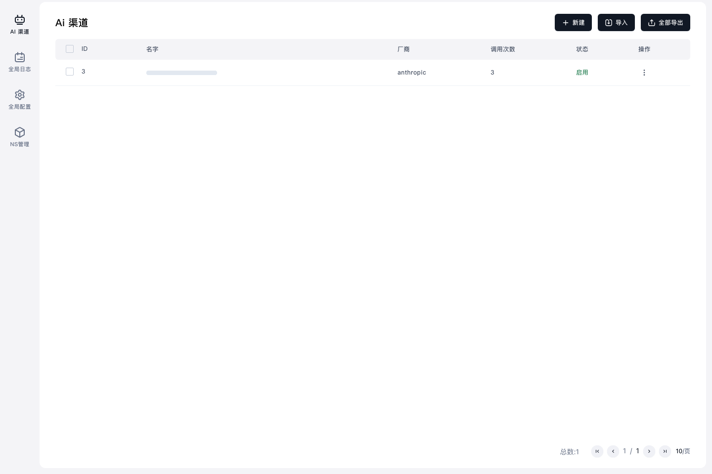

# TC-02 页面配置渠道

## 测试目标

验证 AIProxy 管理中心页面可以打开渠道列表，并通过页面操作配置和保存当前 AI provider 渠道。

## 前置条件

- `aiproxy-web` 已完成 TC-01 的启动修复。
- 浏览器访问地址：`https://aiproxy-web.<cluster-domain>/zh/dashboard`
- 使用 `ns-admin` 工作空间访问页面。

## 关联代码修改

- `app/api/admin/channel/type-name/route.ts:17`：优先请求当前后端支持的 `/api/channels/type_metas`。
- `app/api/admin/channel/type-name/route.ts:38`：把后端 metadata 映射成前端既有的 `ChannelTypeMapName` 结构。
- 保留 `/api/channels/type_names` fallback，避免老后端兼容性回退被破坏。

## 测试流程

1. 打开 AIProxy 管理中心渠道页面。
2. 检查渠道列表正常加载。
3. 通过页面创建或编辑 Anthropic 渠道。
4. 填入当前 provider 配置并保存。
5. 返回渠道列表确认渠道处于启用状态。

## 截图证据

## 预期结果

- 渠道页面不再因为 `/api/channels/type_names` 不存在而失败。
- 页面能正常读取渠道类型。
- 渠道保存后显示在列表中并保持启用。

## 实际结果

- 渠道页面加载成功。
- 测试渠道 `<test-channel-name>` 保存成功。
- 截图中渠道状态可见且页面无错误提示。

结果：通过。
