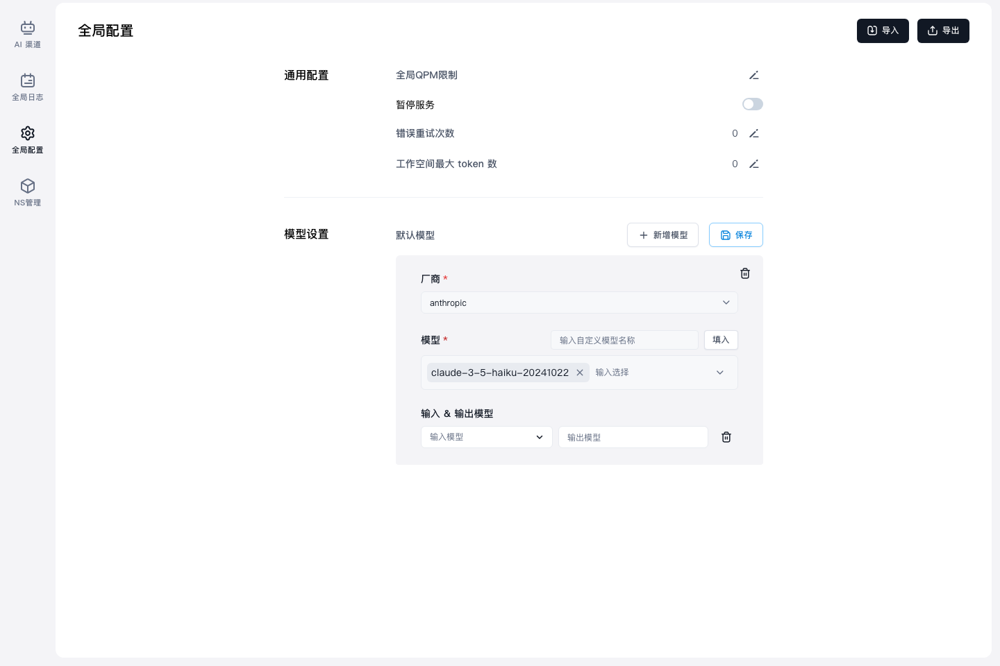
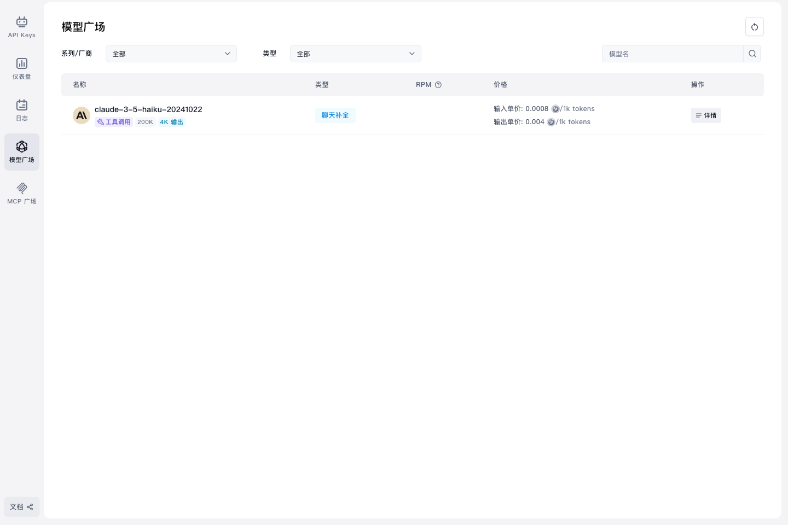

# TC-03 页面访问渠道模型

## 测试目标

验证页面可以访问全局配置和价格/模型页面，并能看到刚才配置渠道对应的可用模型。

## 前置条件

- TC-02 已通过，测试渠道已经保存。
- 测试模型：`claude-3-5-haiku-20241022`

## 关联代码修改

- `app/api/admin/option/batch/route.ts:18`：前端仍对外暴露 `PUT`，但代理到后端时改用后端实际支持的 `POST /api/option/batch`。

## 测试流程

1. 从 AIProxy 管理中心打开全局配置页面。
2. 查看默认模型相关配置是否能加载。
3. 打开价格/模型页面。
4. 搜索或查看 `claude-3-5-haiku-20241022` 是否可见。

## 截图证据

## 预期结果

- 全局配置页面能正常加载。
- 默认模型配置保存路径可用。
- 价格/模型页面能看到 `claude-3-5-haiku-20241022`。

## 实际结果

- 全局配置页面打开成功。
- 默认模型配置代理保存接口返回成功。
- 价格/模型页面显示 `claude-3-5-haiku-20241022`。

结果：通过。
